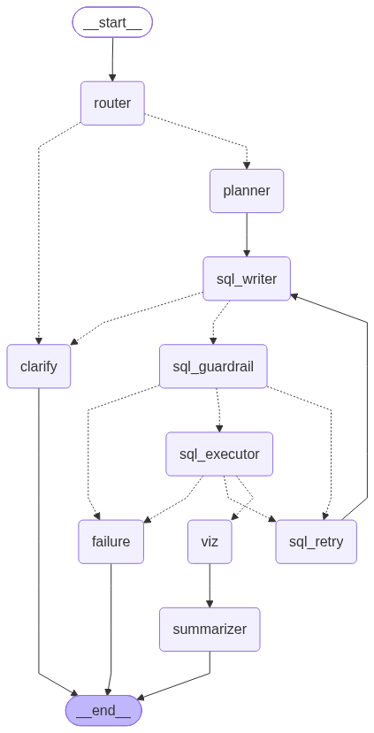
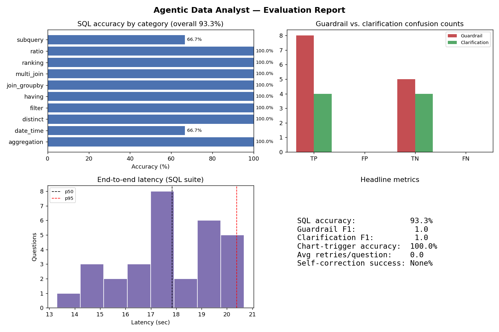

# DataPilot — Agentic SQL & Visualization Agent

An agentic data analyst built on **LangGraph** that turns natural-language questions into
grounded SQL, runs it safely against a database, and answers with a chart and a summary —
with deterministic safety guardrails, self-correcting retries, and multi-turn memory.

Ask it something like *"What's the total revenue by customer segment?"* and it plans the
query, grounds itself in the actual schema, writes SQL, checks that SQL against a
non-LLM safety layer, executes it, decides whether a chart adds value, and summarizes the
result — all inside one LangGraph state machine.

## Architecture



The graph has 9 working nodes plus routing/terminal states:

- **router** — classifies each incoming message (new question / follow-up / off-topic) and directs it to the right node
- **planner** — breaks the question down and identifies which tables/columns are relevant
- **sql_writer** — generates SQL grounded in a live schema profile (columns, types, nulls, cardinality, foreign keys, sample values) instead of relying on the model's memory of the schema
- **sql_guardrail** — a deterministic, non-LLM safety check: single-statement `SELECT`-only enforcement, forbidden-keyword detection (with string literals stripped so keywords inside quoted values can't trigger false positives), comment stripping
- **sql_executor** — runs the validated query against the database
- **sql_retry** — on execution error or guardrail rejection, feeds the failure back into `sql_writer`, capped at 3 attempts
- **clarify** — asks a follow-up question when the request is ambiguous
- **viz** — decides whether the result is chart-worthy and renders one if so
- **summarizer** — turns the result set into a natural-language answer
- **failure** — graceful terminal state when retries are exhausted

## Evaluation results



| Metric | Result |
|---|---|
| SQL accuracy | 93.3% across 30 ground-truth questions, 10 query categories |
| SQL guardrail | 1.0 precision / 1.0 recall / 1.0 F1 (zero false positives, zero false negatives) |
| Clarification handling | 1.0 F1 |
| Chart-trigger accuracy | 100% |
| Avg. retries per question | 0.0 |
| End-to-end latency | ~17.8s median, ~20.4s p95 |

The evaluation harness runs three independent test suites — SQL accuracy against known-correct
queries, guardrail precision/recall against a confusion matrix of destructive attacks and
benign lookalikes, and clarification/chart-trigger correctness — and renders the results above
as a single figure.

## Tech stack

Python · LangGraph · Gemini (`langchain-google-genai`) · SQLite · Matplotlib · Gradio · python-dotenv

## Project structure

```
datapilot-agentic-sql/
├── README.md
├── requirements.txt
├── .env.example
├── notebooks/
│   └── Agentic_Data_Analyst_SQL_Viz.ipynb
└── docs/
    ├── architecture.png
    └── eval_report.png
```

## Setup & usage

1. Clone the repo and move into it:
   ```
   git clone https://github.com/<your-username>/datapilot-agentic-sql.git
   cd datapilot-agentic-sql
   ```
2. Install dependencies:
   ```
   pip install -r requirements.txt
   ```
3. Add your Gemini API key:
   ```
   cp .env.example .env
   # then edit .env and set GOOGLE_API_KEY=your-key-here
   ```
4. Open `notebooks/Agentic_Data_Analyst_SQL_Viz.ipynb` and run all cells. The notebook builds
   a sample SQLite database on first run, launches the evaluation harness, and starts a Gradio
   chat UI for interactive querying.

## Notes

- The SQL guardrail is intentionally rule-based rather than LLM-based, so safety decisions
  never depend on model discretion.
- Two categories (`subquery`, `date_time`) currently sit at 66.7% accuracy in the evaluation
  set — the harness and per-category breakdown make it straightforward to see exactly which
  question types need prompt or schema-grounding improvements next.
